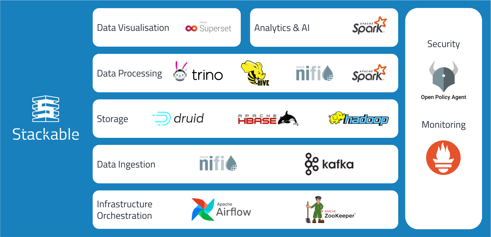

<p align="center">
  
</p>

<h1 align="center">Stackable Operator for Apache Kafka</h1>

[](https://GitHub.com/stackabletech/kafka-operator/graphs/commit-activity)
[](https://docs.stackable.tech/home/stable/contributor/index.html)
[](./LICENSE)

[Documentation](https://docs.stackable.tech/kafka-operator/stable/index.html) | [Stackable Data Platform](https://stackable.tech/) | [Platform Docs](https://docs.stackable.tech/)

This is a Kubernetes Operator to manage [Apache Kafka](https://kafka.apache.org/) clusters.

Looking to dive in? It's easy to get started with the Stackable data platform using `stackablectl`:

```
stackablectl spin up a demo
```

Read more in [link to fancy demo using stackablectl](#).

## Installation

To get the best experience, we recommended way to get started with Stackable is through the `stackablectl` tool.

Read [the instructions below](#) to get started.

## Getting Started

To create a Kafka cluster with three nodes, you can follow this [tutorial](https://docs.stackable.tech/kafka/stable/getting_started/first_steps.html).

Otherwise, give it a try with the [stackablectl](https://docs.stackable.tech/home/stable/getting_started.html) CLI tool!

## Documentation

The documentation for this operator can be found [here](https://docs.stackable.tech/kafka/stable/index.html).

The documentation for all Stackable products can be found at [docs.stackable.tech](https://docs.stackable.tech).

## What Does This Do?

Operator looks at custom resources in the cluster, and makes sure apps are started according to those custom resources.

If those resources change, the operator makes sure that the right actions are taken so the app is the way you want it to be.

Here's what a custom resource for a Kafka cluster can look like:

```
---
apiVersion: kafka.stackable.tech/v1alpha1
kind: KafkaCluster
metadata:
  name: simple-kafka
spec:
  version: 3.2.0-stackable0.1.0
  zookeeperConfigMapName: simple-kafka-znode
  config:
    tls: null
  brokers:
    roleGroups:
      default:
        replicas: 3
```

Want to get started? Read below.

## Behind the Scenes

It is written by [Stackable](https://www.stackable.tech) in Rust.

It uses kube-rs to talk to Kubernetes.

We test it [extensively](https://ci.stackable.tech/) using [Kuttl](https://kuttl.dev/)-powered integration tests on managed Kubernetes of multiple cloud platforms and our own bare-metal clusters.

NEXT: generic behind the scenes

## About The Stackable Data Platform

This operator is written and maintained by [Stackable](https://www.stackable.tech) and it is part of a larger platform.



Stackable makes it easy to operate data applicationsin any Kubernetes cluster.

The data platform offers many operators, new ones being added continuously. All our operators are designed and built to be easily interconnected and to be consistent to work with.

Stackable GmbH is the company behind the Stackable Data Platform. Offering professional services, paid support plans and development.

We love open-source!

# Supported Platforms

We develop and test our operators for the following cloud platforms:

* Kubernetes 1.21-1.24
* EKS on Amazon Web Services (AWS)
* GKE on Google Cloud Platform (GCP)
* AKS on Microsoft Azure
* k3s

We are currently working to support:

* OpenShift

### Other Operators

These are the Operators currently part of the Stackable Data Platform, many of which use the Secret Operator.

- [Apache Airflow Operator](https://github.com/stackabletech/airflow-operator)
- [Apache Druid Operator](https://github.com/stackabletech/druid-operator)
- [Apache HBase Operator](https://github.com/stackabletech/hbase-operator)
- [Apache Hadoop HDFS Operator](https://github.com/stackabletech/hdfs-operator)
- [Apache Hive Operator](https://github.com/stackabletech/hive-operator)
- [Apache Kafka Operator](https://github.com/stackabletech/kafka-operator)
- [Apache NiFi Operator](https://github.com/stackabletech/nifi-operator)
- [Apache Spark Operator](https://github.com/stackabletech/spark-k8s-operator)
- [Apache Superset Operator](https://github.com/stackabletech/superset-operator)
- [Trino Operator](https://github.com/stackabletech/trino-operator)
- [Apache ZooKeeper Operator](https://github.com/stackabletech/zookeeper-operator)
- [OpenPolicyAgent Operator](https://github.com/stackabletech/opa-operator)

## Contributing

Contributions are welcome. Follow our [Contributors Guide](https://docs.stackable.tech/home/stable/contributor/index.html) to learn how you can contribute.

## License

[Open Software License version 3.0](./LICENSE).

## Support

You can use this project under different licenses. Get started with the community edition! If you want professional support, [we offer subscription plans](https://stackable.tech/en/plans/).